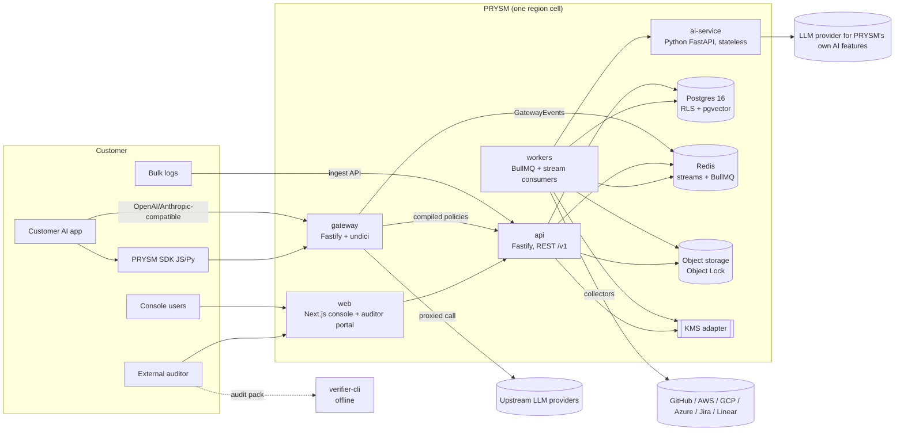
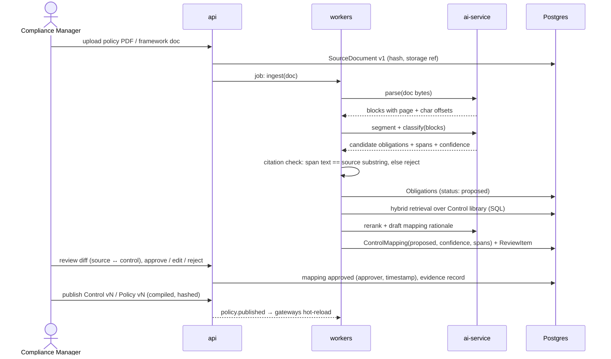
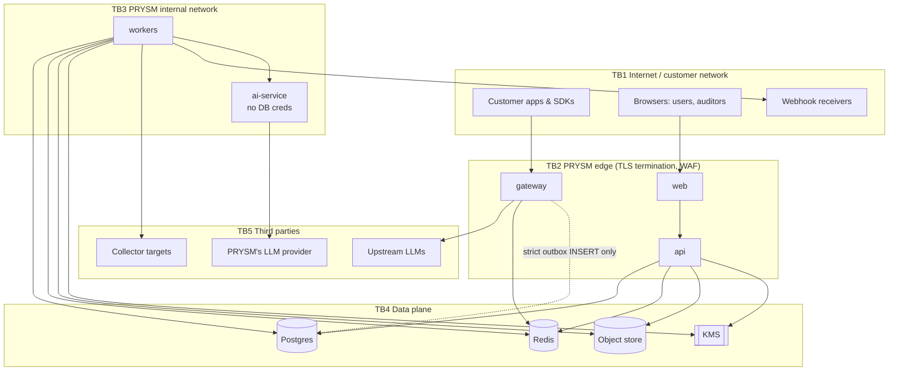

# PRYSM Architecture

Status: **Accepted** (v1, 2026-09-24). Decisions referenced as ADR-000N live in `docs/adr/`.

## 1. System context



## 2. Services

| Service | Language | Responsibility | State | Scales by |
|---|---|---|---|---|
| `gateway` | TS (Fastify + undici) | OpenAI/Anthropic-compatible proxy. Runs detectors and deterministic policy inline, handles streaming, enforces rate limits and budgets, emits GatewayEvents | Stateless. In-memory compiled policies; local disk spool for events when Redis is unavailable | Horizontal pods, per region |
| `api` | TS (Fastify) | Public REST `/v1`, auth, RBAC, CRUD for the domain, policy publish, simulation requests, log ingestion, webhooks in, auditor portal API | Stateless | Horizontal |
| `web` | TS (Next.js App Router) | Customer console and auditor portal. Talks only to `api` | Stateless | Horizontal |
| `workers` | TS | Event ingest (evidence append, evaluations), scheduled drift checks, collectors, document pipeline orchestration, LLM-judge jobs, reports and audit packs, notifications, anchoring, retention | Stateless. Jobs live in Redis | Horizontal per queue |
| `ai-service` | Python 3.12 (FastAPI) | Document parsing with layout, segmentation, classification, embeddings, reranking, LLM-judge calls. **Has no database credentials.** It receives inputs from workers and returns results; workers persist them | Stateless | Horizontal |
| `verifier-cli` | Go | Offline verification of audit packs: chain, Merkle proofs, signatures, RFC 3161 tokens | None | n/a |

Shared packages: `policy-engine` (pure evaluator, used by gateway, workers and api), `detectors` (pure), `evidence` (canonicalization, hashing, Merkle, signing, used by workers and api), `db` (schema, migrations, RLS, `withTenant()`), `core-types` (zod schemas, the source of the OpenAPI spec).

**Why ai-service has no DB access:** it processes untrusted documents and talks to LLMs, which makes it the service most exposed to prompt injection. Keeping it free of credentials limits the blast radius, and it leaves the schema and RLS with a single owner, the TS side. Hybrid retrieval runs in `workers` as SQL (pgvector + `tsvector`); the ai-service only embeds and reranks.

## 3. Data flows

### 3.1 Setup track: rule → enforceable control



When a new version of a source document is uploaded, it is diffed against the previous version at the block level. Obligations whose cited spans changed or disappeared are marked `stale`, and their mappings and controls get ReviewItems.

### 3.2 Live track: model call → evidence → finding

```mermaid
sequenceDiagram
  participant App as Customer app
  participant GW as gateway
  participant LLM as Upstream LLM
  participant RD as Redis stream
  participant WK as workers
  participant PG as Postgres
  participant S3 as Object storage
  App->>GW: POST /v1/chat/completions (PRYSM key)
  GW->>GW: auth key → tenant/app, rate limit, budget
  GW->>GW: detectors(prompt) → facts; policy.eval(pre) → allow/redact/block
  alt blocked
    GW-->>App: provider-shaped error
  else allowed/redacted
    GW->>LLM: forward (redacted if required)
    LLM-->>GW: stream chunks
    GW->>GW: passthrough / holdback / buffered inspection (ADR-0008)
    GW-->>App: chunks (redacted/annotated/terminated)
  end
  GW-)RD: XADD GatewayEvent (non-blocking; disk spool fallback)
  RD-)WK: consumer group (sharded by tenant)
  WK->>S3: payload per retention mode (encrypted, object-locked)
  WK->>PG: EvidenceRecord (seq, prev_hash, payload_hash) + Evaluation
  WK->>PG: Finding (dedup/group) on fail
  WK-)WK: async LLM-judge jobs → ReviewItem when below threshold
  WK-)WK: notifications (email/webhook/Slack/Teams)
```

Scheduled checks (drift) and collectors take the same path from the `workers` side. They produce evidence and evaluations, and a failed evaluation opens a finding. A finding closes only when a later evaluation of the same control and scope passes.

## 4. Tenancy and data layout (ADR-0007)

- One Postgres per region cell with a shared schema. Every tenant table has `tenant_id` with `ENABLE` + `FORCE ROW LEVEL SECURITY`. The policy is `tenant_id = current_setting('app.tenant_id')::uuid`.
- The app connects as `prysm_app`, which has no `BYPASSRLS` and does not own the tables. Migrations run as `prysm_owner`. Cross-tenant platform jobs such as anchoring use `prysm_platform`, only through audited code paths.
- Every DB access goes through `withTenant(tenantId, tx => …)`, which runs `set_config('app.tenant_id', $1, true)` inside a transaction. That makes it safe with PgBouncer transaction pooling.
- FKs are composite `(tenant_id, id)`, so a row cannot reference another tenant's row.
- Redis keys, S3 prefixes and queue job payloads all carry the `tenant_id`. S3 payloads are encrypted client-side with the tenant DEK.
- **Data residency:** each region is an independent cell (DB, Redis, storage, gateway). A tenant is pinned to one region. A thin global directory maps login domains to regions (M12).
- Self-hosted is the same code with one tenant row.

## 5. Evidence (ADR-0006)

- `EvidenceRecord` envelope → RFC 8785 JCS → SHA-256, chained per tenant by `seq` and `prev_hash`. The payload is referenced by `payload_hash`, so the chain stays verifiable after a payload expires.
- Anchors: an RFC 6962-style Merkle root over a range of records, plus the chain head, signed with Ed25519. They are delivered off-platform (customer webhook or bucket, optionally an RFC 3161 TSA), because otherwise an insider holding both the DB and the signing key could rewrite history.
- Postgres grants give `prysm_app` only `INSERT, SELECT` on evidence tables. A trigger rejects `UPDATE` and `DELETE` for every role except retention expiry, which runs as `prysm_platform` and writes its own expiry record.
- Object Lock is in COMPLIANCE mode, with the retention period set per object at write time.

## 6. Trust boundaries



| Boundary | What crosses it | Key controls |
|---|---|---|
| TB1→TB2 | Prompts and responses, console sessions, API keys | TLS 1.2+, scoped API keys (hashed at rest), OIDC/SAML sessions with MFA, rate limits, zod validation, CSP |
| TB2→TB4 (gateway → Postgres) | Strict-tenant durable events only | Dedicated pool, role `prysm_gateway_outbox` with INSERT-only on `strict_outbox`, RLS `WITH CHECK`, no SELECT on anything, PgBouncer (ADR-0009) |
| TB2→TB5 (gateway → LLM) | Customer prompts (possibly redacted) | Upstream allowlist per provider, egress restricted to provider hosts, customer's provider credentials encrypted with tenant DEK |
| TB3→TB5 (workers → collectors / webhooks) | Customer cloud credentials, outbound calls | SSRF guard (DNS resolve → deny private/link-local/metadata ranges, re-check on redirect), least-privilege scopes, encrypted credentials |
| TB3 (workers → ai-service) | Untrusted documents | ai-service has no DB creds, output is schema-validated, citation spans checked mechanically, humans approve |
| TB2/TB3→TB4 | All tenant data | RLS, non-owner roles, per-tenant DEKs, evidence write-only grants |
| Off-platform anchor | Signed Merkle roots | Customer-held copy and TSA make history rewrites detectable |

## 7. Deployment topologies

- **SaaS:** AWS first (no account yet, so Terraform is written and validated in M11 but not applied until one exists). Per region: EKS, RDS Postgres 16 (pgvector, Multi-AZ synchronous standby), MemoryDB for event streams and BullMQ plus ElastiCache for Valkey for rate limits, caches and pub/sub (preferred option, purchase deferred to M4, ADR-0009), S3 with Object Lock, and KMS. Terraform in `infra/terraform`, workloads via the Helm chart.
- **Self-hosted:** the same Helm chart, or Docker Compose for small installs. Customer-supplied Postgres, a Redis-compatible store (Valkey is the reference; Redis ≥ 7.2 is accepted) and S3-compatible storage with Object Lock. Strict durability needs no extra component, because it uses a Postgres outbox (ADR-0009). The local KMS adapter keeps its master key in a file or HSM via PKCS#11 (M11).
- **Local dev:** `infra/docker/compose.dev.yml` runs Postgres, Valkey, S3-compatible storage with object lock (implementation per TRACKING F-33) and an OTel collector with Grafana LGTM.

"Redis" in this document means the Redis protocol and data model. The reference engine is Valkey (ADR-0009).

## 8. Cross-cutting

- **API contract:** zod schemas in `core-types` are the source of truth. The OpenAPI 3.1 spec is generated, committed at `docs/api/openapi.json`, and CI fails on drift and flags breaking diffs (ADR-0002).
- **Observability:** OpenTelemetry SDK in every service. Traces propagate gateway → Redis event (trace context in the event) → workers. Prometheus metrics. Pino JSON logs with a redaction allowlist (only listed fields are logged; payload fields are never on the list).
- **Config:** env vars validated at boot with zod. The process refuses to start on invalid config.
- **Shutdown:** SIGTERM → readiness goes false → drain in-flight requests and streams (gateway, bounded at 30 s) → flush the event spool → exit.
- **Versioning:** every GatewayEvent, Evaluation and Finding records the policy version hash, detector versions and gateway build, so any verdict can be reproduced.
- **PRYSM's own LLM calls:** a single provider-agnostic adapter in the ai-service. Each call logs provider, model, template id@version, SHA-256 of the inputs, output, token counts and latency, as an evidence record. The initial providers are **Google Gemini API** (hosted) and **Ollama**, plus any OpenAI-compatible local endpoint such as vLLM (self-hosted, no external LLM). The provider is selected per tenant. **Hard requirement (ADR-0010):** customer data only goes to a provider tier that contractually excludes training on it: the paid Gemini API (billing-enabled project) or Vertex AI once verified. Never the unpaid tier.
- **LLM-off mode:** every deterministic feature (gateway, policies, detectors, evidence, findings, reports) works with no LLM configured. LLM-dependent features (obligation extraction, mapping proposals, `llm_judge` rules) are clearly marked unavailable, never silently skipped.
- **Object storage** is behind an `ObjectStore` interface (put with retention, get, lock status, expire). The Object Lock COMPLIANCE requirement is checked at boot, and the process refuses to start without it. SaaS uses cloud-native Object Lock (S3 COMPLIANCE first). Dev, CI and self-hosted use SeaweedFS (RustFS also supported), and every store must pass `infra/objectstore-conformance/conformance.sh` (ADR-0011).

## 9. Invariants (each backed by a test)

1. `prysm_app` cannot read any row whose `tenant_id` differs from `app.tenant_id`, on every tenant table (generated test over `pg_class`).
2. `prysm_app` cannot `UPDATE` or `DELETE` evidence tables.
3. An approved ControlMapping or Obligation always has ≥1 citation span whose text equals `source[start:end]`.
4. The policy engine gives the same output for the same `(compiled policy, facts, now)`, which is checked by property tests.
5. The verifier rejects any altered, reordered or removed record, anchor or signature (mutation test vectors shared by the TS and Go implementations).
6. UI strings, report templates and docs contain no "compliant / compliance certified" claims (CI wording check with an allowlist of exceptions).
